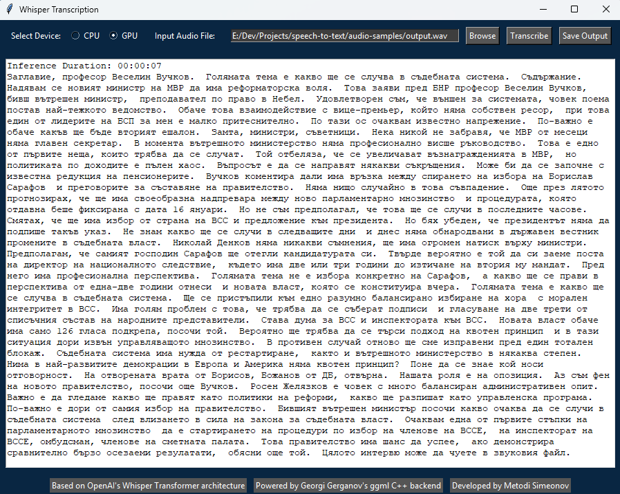

# Speech-to-Text Converter

A tool for converting audio files to text using OpenAI's Whisper model architecture.



## Installation

1. Install:
    - [Visual Studio 2022](https://visualstudio.microsoft.com/downloads/) with C++ build tools.
    - [CMake 3.21.3](https://cmake.org/download/)
    - [NVIDIA CUDA Toolkit 12.6](https://developer.nvidia.com/cuda-12-6-2-download-archive) for your OS.
    - [ffmpeg](https://ffmpeg.org/download.html) for your OS. Place the `ffmpeg` folder in the root directory of the project.

2. Clone the repository:
    ```bash
    git clone https://github.com/ggerganov/whisper.cpp.git
    ```

3. Create and navigate to the build directory:
    ```bash
    mkdir build
    ```
    ```bash
    cd build
    ```

4. Configure two projects with CMake (one for CPU and one for GPU inference):
    - CPU Inference:
    ```bash
    cmake -B build_cpu -DGGML_CUDA=0 ..
    ```
    - GPU Inference:
    ```bash
    cmake -B build_gpu -DGGML_CUDA=1 -DCUDAToolkit_ROOT="C:\Program Files\NVIDIA GPU Computing Toolkit\CUDA\v12.6" -DCudaToolkitDir="C:\Program Files\NVIDIA GPU Computing Toolkit\CUDA\v12.6" ..
    ```

5. Build the project:
    ```bash
    cmake --build build_cpu -j --config Release
    cmake --build build_gpu -j --config Release
    ```

6. Donwload a `Whisper` model of choice from [Huggingface](https://huggingface.co/ggerganov/whisper.cpp/tree/main). The model should be placed in the `models` directory.

7. Run the server to test both CPU and GPU inference:
    - CPU Inference (rename the `whisper-server.exe` to `whisper-server-cpu.exe`):
    ```bash
    C:\dev\whisper.cpp\build\bin\Release\whisper-server-cpu.exe --host 127.0.0.1 --port 8080 -m "models/ggml-large-v3-turbo-q8_0.bin" --convert -t 24 -l bg
    ```
    - GPU Inference (rename the file `whisper-server.exe` to `whisper-server-gpu.exe`):
    ```bash
    C:\dev\whisper.cpp\build\bin\Release\whisper-server-gpu.exe --host 127.0.0.1 --port 8080 -m "models/ggml-large-v3-turbo-q8_0.bin" --convert -t 24 --ov-e-device CUDA -l bg
    ```
    - Sample request:
    ```python
    import requests 
    response = requests.post('http://localhost:8080', files={'file': open('path/to/audio/file.wav', 'rb')})
    print(response.text)
    ```

## Creating Executable

1. Install PyInstaller:
    ```bash
    pip install pyinstaller
    ```
2. Create CPU & GPU executable:
    ```bash
    pyinstaller app_cpp_cpu_gpu.py ^
        --onedir ^
        --noconsole ^
        --name "Bg-Audio-Transcriber" ^
        --add-binary "E:/Dev/Projects/speech-to-text/Release/build_cpu/ggml.dll;Release/build_cpu/" ^
        --add-binary "E:/Dev/Projects/speech-to-text/Release/build_cpu/whisper.dll;Release/build_cpu/" ^
        --add-binary "E:/Dev/Projects/speech-to-text/Release/build_cpu/ggml-cpu.dll;Release/build_cpu/" ^
        --add-binary "E:/Dev/Projects/speech-to-text/Release/build_cpu/ggml-base.dll;Release/build_cpu/" ^
        --add-binary "E:/Dev/Projects/speech-to-text/Release/build_cpu/whisper-server-cpu.exe;Release/build_cpu/" ^
        --add-binary "E:/Dev/Projects/speech-to-text/Release/build_cpu/models/ggml-large-v3-turbo-q8_0.bin;Release/build_cpu/models/" ^
        --add-binary "E:/Dev/Projects/speech-to-text/Release/build_gpu/models/ggml-large-v3-turbo-q8_0.bin;Release/build_gpu/models/" ^
        --add-binary "E:/Dev/Projects/speech-to-text/Release/build_gpu/whisper-server-gpu.exe;Release/build_gpu/" ^
        --add-binary "E:/Dev/Projects/speech-to-text/Release/build_gpu/ggml-cuda.dll;Release/build_gpu/" ^
        --add-binary "E:/Dev/Projects/speech-to-text/Release/build_gpu/ggml-base.dll;Release/build_gpu/" ^
        --add-binary "E:/Dev/Projects/speech-to-text/Release/build_gpu/ggml-cpu.dll;Release/build_gpu/" ^
        --add-binary "E:/Dev/Projects/speech-to-text/Release/build_gpu/whisper.dll;Release/build_gpu/" ^
        --add-binary "E:/Dev/Projects/speech-to-text/Release/build_gpu/ggml.dll;Release/build_gpu/" ^
        --add-data "E:/Dev/Projects/speech-to-text/ffmpeg;ffmpeg"
    ```

3. Create CPU dedicated executable:
    ```bash
    pyinstaller app_cpp_cpu.py ^
        --onedir ^
        --noconsole ^
        --name "Bg-Audio-Transcriber" ^
        --add-binary "E:/Dev/Projects/speech-to-text/Release/build_cpu/ggml.dll;Release/build_cpu/" ^
        --add-binary "E:/Dev/Projects/speech-to-text/Release/build_cpu/whisper.dll;Release/build_cpu/" ^
        --add-binary "E:/Dev/Projects/speech-to-text/Release/build_cpu/ggml-cpu.dll;Release/build_cpu/" ^
        --add-binary "E:/Dev/Projects/speech-to-text/Release/build_cpu/ggml-base.dll;Release/build_cpu/" ^
        --add-binary "E:/Dev/Projects/speech-to-text/Release/build_cpu/whisper-server-cpu.exe;Release/build_cpu/" ^
        --add-binary "E:/Dev/Projects/speech-to-text/Release/build_cpu/models/ggml-large-v3-turbo-q8_0.bin;Release/build_cpu/models/" ^
        --add-data "E:/Dev/Projects/speech-to-text/ffmpeg;ffmpeg"
    ```

## Project Structure

```bash
speech-to-text/
  ├── app_cpp_cpu.py
  ├── app_cpp_cpu_gpu.py
  ├── ffmpeg/
  │   ├── bin/
  ├── Release/
  │   ├── build_cpu/
  │   │   ├── models/
  │   │   │   └── ggml-large-v3-turbo-q8_0.bin
  │   │   └── whisper-server-cpu.exe
  │   │   └── ggml-gpu.dll
  │   │   └── whisper.dll
  │   │   └── ggml.dll
  │   │   └── ... 
  │   ├── build_gpu/
  │   │   ├── models/
  │   │   │   └── ggml-large-v3-turbo-q8_0.bin
  │   │   └── whisper-server-gpu.exe
  │   │   └── ggml-cpu.dll
  │   │   └── whisper.dll
  │   │   └── ggml.dll
  │   │   └── ...
```